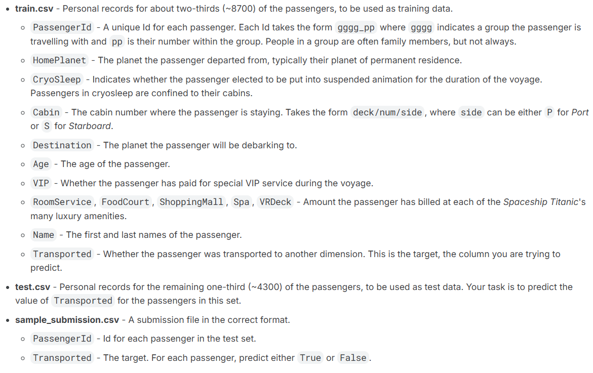

```{r setup, include=FALSE}
knitr::opts_chunk$set(echo = TRUE)
```


# Load packages
```{r}

if (!requireNamespace("tidyverse")) install.packages('tidyverse')
if (!requireNamespace("caret")) install.packages('caret')
if (!requireNamespace("leaps")) install.packages('leaps')
if (!requireNamespace("bestglm")) install.packages('bestglm')
if (!requireNamespace("MASS")) install.packages('MASS')
if (!requireNamespace("ggplot2")) install.packages('ggplot2')
if (!requireNamespace("gridExtra")) install.packages('gridExtra')
if (!requireNamespace("dplyr"))install.packages("dplyr")
if (!requireNamespace("rpart"))install.packages("rpart")

library(ggplot2)
library(gridExtra)
library(tidyverse)
library(caret)
library(leaps)
library(bestglm)
library(MASS)
library(dplyr)
library(rpart)
```




# load files
```{r}

data <- read_csv("../data/train.csv")
test <- read_csv("../data/test.csv")
head(data)
head(test)

```

```{r}
# Summary
summary(data)
summary(test)
```


```{r}
# Convert to dataframe
data <- data.frame(data)
test <- data.frame(test)

# Dtype
str(data)
str(test)

# NA
colSums(is.na(data))
colSums(is.na(test))
```
# Extract the group number from the passenger ID.
```{r}
data$Group <- as.integer(sub(".*_", "", data$PassengerId))
test$Group <- as.integer(sub(".*_", "", test$PassengerId))
data$Number <- as.integer(sub("_.*", "", data$PassengerId))
test$Number <- as.integer(sub("_.*", "", test$PassengerId))
unique(data$Group)
```

# Fill missing Homeplanet and Destination by Other
```{r}
# Home Planet
sum(is.na(data$HomePlanet))
unique(data$HomePlanet)
sum(is.na(test$HomePlanet))
unique(test$HomePlanet)

## Fill NA by Other
data$HomePlanet[is.na(data$HomePlanet)] <- "Other"
test$HomePlanet[is.na(test$HomePlanet)] <- "Other"

## Fill NA by Other
data$Destination[is.na(data$Destination)] <- "Other"
test$Destination[is.na(test$Destination)] <- "Other"

sum(is.na(data$HomePlanet))
unique(data$HomePlanet)
sum(is.na(test$HomePlanet))
unique(test$HomePlanet)


sum(is.na(data$Destination))
unique(data$Destination)
sum(is.na(test$Destination))
unique(test$Destination)
```

# Fill missing VIP by FALSE
```{r}
# Fill missing VIP values with FALSE
data <- data %>%
  mutate(VIP = ifelse(is.na(VIP), FALSE, VIP))

test <- test %>%
  mutate(VIP = ifelse(is.na(VIP), FALSE, VIP))
```

# Fill missing spendings by 0 and compute total spending.
```{r}
# Step 1: Make spending numeric
spending_cols <- c("RoomService", "FoodCourt", "ShoppingMall", "Spa", "VRDeck")
data[spending_cols] <- lapply(data[spending_cols], as.numeric)
test[spending_cols] <- lapply(test[spending_cols], as.numeric)

# Step 2: Convert NA to 0 for any spending ("RoomService", "FoodCourt", "ShoppingMall", "Spa", "VRDeck").
# List of attributes to fill
cols_to_fill <- c("RoomService", "FoodCourt", "ShoppingMall", "Spa", "VRDeck")
# Fill NAs with 0 in data
data <- data %>%
  mutate(across(all_of(cols_to_fill), ~ ifelse(is.na(.), 0, .)))
# Fill NAs with 0 in test
test <- test %>%
  mutate(across(all_of(cols_to_fill), ~ ifelse(is.na(.), 0, .)))

# Step 3: Compute total spending per passenger
data$total_spending <- rowSums(data[spending_cols], na.rm = TRUE)
test$total_spending <- rowSums(test[spending_cols], na.rm = TRUE)
```

# Fill missing cryosleep with FASLE
```{r}
data$CryoSleep[is.na(data$CryoSleep)] <- FALSE
test$CryoSleep[is.na(test$CryoSleep)] <- FALSE
```

# Split Cabin into Deck, Cabin_num, Side
```{r}
# Cabin Number Split:
data[c("Deck", "Cabin_num", "Side")] <- do.call(rbind, strsplit(data$Cabin, "/"))
test[c("Deck", "Cabin_num", "Side")] <- do.call(rbind, strsplit(test$Cabin, "/"))
```

# Fill the Deck using DT
```{r}
combined <- bind_rows(
   mutate(data, dataset = "train"),
   mutate(test, dataset = "test")
)

combined$Deck <- as.factor(combined$Deck)

combined$HomePlanet  <- as.factor(combined$HomePlanet)
combined$CryoSleep   <- as.factor(combined$CryoSleep)
combined$Destination <- as.factor(combined$Destination)
combined$VIP         <- as.factor(combined$VIP)

train_deck <- combined %>% filter(!is.na(Deck))
missing_deck <- combined %>% filter(is.na(Deck))

deck_model <- rpart(
  Deck ~ HomePlanet + CryoSleep + Destination + Age + VIP +
         RoomService + FoodCourt + ShoppingMall + Spa + VRDeck +
         Group + Number + total_spending,
  data = train_deck,
  method = "class"
)

predicted_deck <- predict(deck_model, missing_deck, type = "class")

combined$Deck[is.na(combined$Deck)] <- predicted_deck

data <- combined %>% 
  dplyr::filter(dataset == "train") %>% 
  dplyr::select(-dataset)

test <- combined %>% 
  dplyr::filter(dataset == "test") %>% 
  dplyr::select(-dataset)
```


# Fill the cabin Number by the dession Tree model.
```{r}
combined <- bind_rows(
  data %>% mutate(dataset = "train"),
  test %>% mutate(dataset = "test")
)

combined$HomePlanet  <- as.factor(combined$HomePlanet)
combined$CryoSleep   <- as.factor(combined$CryoSleep)
combined$Destination <- as.factor(combined$Destination)
combined$VIP         <- as.factor(combined$VIP)
combined$Deck        <- as.factor(combined$Deck)

train_cabin <- combined %>% dplyr::filter(!is.na(Cabin_num))
missing_cabin <- combined %>% dplyr::filter(is.na(Cabin_num))

cabin_model <- rpart(
  Cabin_num ~ HomePlanet + CryoSleep + Destination + Age + VIP +
              RoomService + FoodCourt + ShoppingMall + Spa + VRDeck +
              Group + Number + total_spending + Deck,
  data = train_cabin,
  method = "anova", 
  control = rpart.control(maxdepth = 6, minsplit = 20)
)

predicted_cabin <- predict(cabin_model, missing_cabin)

combined$Cabin_num[is.na(combined$Cabin_num)] <- round(predicted_cabin)

data <- combined %>% 
  dplyr::filter(dataset == "train") %>% 
  dplyr::select(-dataset)

test <- combined %>% 
  dplyr::filter(dataset == "test") %>% 
  dplyr::select(-dataset)
```


```{r}
head(data)
```


# Fill missing Ages by Dession tree
```{r}
combined <- bind_rows(data, test)

# Fit a regression tree using rows with known Age
age_tree <- rpart(
  Age ~ Deck + VIP + CryoSleep + total_spending + RoomService + FoodCourt + ShoppingMall + Spa + VRDeck + Group,
  data = combined[!is.na(data$Age), ],
  method = "anova"  # anova method = regression
)

# Predict Age for missing rows
data$Age[is.na(data$Age)] <- predict(age_tree, newdata = data[is.na(data$Age), ])
test$Age[is.na(test$Age)] <- predict(age_tree, newdata = test[is.na(test$Age), ])
```

# Fill missing Side by simple tree model.
```{r}
combined <- bind_rows(
  data %>% mutate(dataset = "train"),
  test %>% mutate(dataset = "test")
)

combined$HomePlanet  <- as.factor(combined$HomePlanet)
combined$CryoSleep   <- as.factor(combined$CryoSleep)
combined$Destination <- as.factor(combined$Destination)
combined$VIP         <- as.factor(combined$VIP)
combined$Deck        <- as.factor(combined$Deck)
combined$Side        <- as.factor(combined$Side)

train_cabin <- combined %>% dplyr::filter(!is.na(Side))
missing_cabin <- combined %>% dplyr::filter(is.na(Side))


cabin_model <- rpart(
  Side ~ HomePlanet + CryoSleep + Destination + Age + VIP +
              RoomService + FoodCourt + ShoppingMall + Spa + VRDeck +
              Group + Number + total_spending + Deck + Cabin_num,
  data = train_cabin,
  method = "anova", 
  control = rpart.control(maxdepth = 6, minsplit = 20)
)

predicted_side <- predict(cabin_model, missing_cabin)

combined$Cabin_num[is.na(combined$Cabin_num)] <- round(predicted_side)

data <- combined %>% 
  dplyr::filter(dataset == "train") %>% 
  dplyr::select(-dataset)

test <- combined %>% 
  dplyr::filter(dataset == "test") %>% 
  dplyr::select(-dataset)
```

```{r}
head(data)
```

# Fill missing cabins with the predicted Deck/Cabin_num/Side
```{r}
data <- data %>%
  mutate(
    Cabin = ifelse(
      is.na(Cabin),
      paste(Deck, Cabin_num, Side, sep = "/"),
      Cabin
    )
  )

test <- test %>%
  mutate(
    Cabin = ifelse(
      is.na(Cabin),
      paste(Deck, Cabin_num, Side, sep = "/"),
      Cabin
    )
  )
```

# Save File after cleaning.
```{r}
write.csv(data, "../data/cleaned_data.csv", row.names = FALSE)
write.csv(test, "../data/cleaned_test.csv", row.names = FALSE)
```
